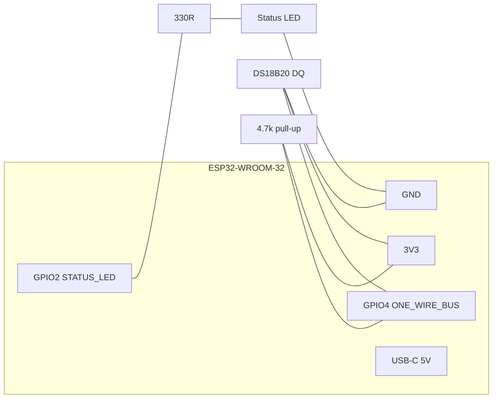

# ThermaProbe — Assembly Guide

How to build one ThermaProbe unit. Parts are in [BOM.md](BOM.md). Every pin
number here is copied from `firmware/src/protocol.h` — **if you change a pin in
the firmware, change it here too**, or the hardware and the flashed firmware
will drift apart.

- Firmware: v2.0.0, protocol v1
- MCU: ESP32-WROOM-32 / -32E
- Default sensor: DS18B20 on **GPIO4**, 4.7 kΩ pull-up to **3V3**
- Status LED: **GPIO2** (active-high; on-board LED on most dev boards)
- Optional MAX31855 (SPI): CS **GPIO5**, SCK **GPIO18**, MISO/SO **GPIO19**

---

## 1. GPIO pinout (matches `protocol.h`)

| Signal | ESP32 GPIO | `protocol.h` macro | Connects to |
|--------|-----------|--------------------|-------------|
| DS18B20 data (DQ) | **GPIO4** | `ONE_WIRE_BUS` | DS18B20 yellow/white DATA lead |
| DS18B20 pull-up | GPIO4 ↔ 3V3 | (4.7 kΩ) | 4.7 kΩ between GPIO4 and 3V3 |
| Status LED | **GPIO2** | `STATUS_LED` (`STATUS_LED_ACTIVE_HIGH=1`) | LED anode (via 330 Ω) |
| MAX31855 CS *(opt)* | **GPIO5** | `MAX31855_CS` | MAX31855 CS |
| MAX31855 SCK *(opt)* | **GPIO18** | `MAX31855_SCK` (VSPI SCK) | MAX31855 SCK |
| MAX31855 SO *(opt)* | **GPIO19** | `MAX31855_MISO` (VSPI MISO) | MAX31855 SO (read-only, no MOSI) |
| Power | 3V3, GND | — | sensor VDD/GND, LED cathode |

Powered over the ESP32 dev board's **USB-C** connector (5 V in; the on-board
regulator supplies the 3V3 rail used by the sensor).

---

## 2. Wiring diagram

### Standard DS18B20 build

```
                         ESP32-WROOM-32 devkit
                       +-----------------------+
                       |                       |
      DS18B20          |                       |
   (waterproof)        |                  3V3 o---+------------+
   +----------+        |                       |  |            |
   | RED  VDD |--------o 3V3                    |  |          [4.7k]   <- pull-up
   | BLK  GND |--------o GND                    |  |            |
   | YEL  DQ  |--------o GPIO4  (ONE_WIRE_BUS) o-+--+------------+
   +----------+        |                       |
                       |                  GPIO2 o----[330R]----|>|----o GND
                       |             (STATUS_LED)          status LED
                       |                       |
                       |                 USB-C o====  5V power / flashing
                       +-----------------------+

   Pull-up: 4.7k resistor from GPIO4 (DQ) to 3V3  -- REQUIRED, bus won't read without it.
   LED: GPIO2 -> 330R -> LED anode -> LED cathode -> GND (active-high).
```

### Optional MAX31855 thermocouple build (VSPI)

```
        ESP32                         MAX31855 breakout
   GPIO5  (CS)   ------------------->  CS
   GPIO18 (SCK)  ------------------->  SCK
   GPIO19 (MISO) <-------------------  SO      (read-only; no MOSI)
   3V3           ------------------->  VIN / 3V3
   GND           ------------------->  GND
                                       T+ / T-  ---> K-type thermocouple
```



---

## 3. Step-by-step assembly

1. **Bench-test the bare board first.** Plug the ESP32 into USB-C and flash the
   ThermaProbe firmware (v2.0.0). Confirm it boots and prints its `probe_id`
   (`ThermaProbe-<HEX6>`) over serial before you solder anything.
2. **Fit the 4.7 kΩ pull-up.** Solder the 4.7 kΩ resistor between **GPIO4** and
   **3V3**. This is mandatory for the DS18B20 OneWire bus. Easiest is to solder it
   directly across the two header pins or on a small perfboard tab.
3. **Wire the DS18B20.**
   - RED (VDD) → **3V3**
   - BLACK (GND) → **GND**
   - YELLOW/WHITE (DQ) → **GPIO4** (same node as the pull-up)
   Twist/heatshrink the joints; the pull-up must sit on the GPIO4/DQ node.
4. **Wire the status LED** (skip if you're using the board's on-board GPIO2 LED):
   **GPIO2** → 330 Ω → LED **anode**; LED **cathode** → **GND**. Active-high, so it
   lights when GPIO2 is driven high.
5. *(Optional MAX31855)* Solder CS→**GPIO5**, SCK→**GPIO18**, SO→**GPIO19**,
   plus 3V3 and GND. Attach the K-type thermocouple to T+/T−. Rebuild firmware
   with `-D SENSOR_MAX31855`.
6. **Route the probe lead through the enclosure gland/grommet** *before* final
   soldering so you don't have to re-thread it. Leave a service loop inside.
7. **Add strain relief:** tighten the cable gland, or anchor the lead to an
   internal boss with a zip-tie so cable pulls never reach the solder joints.
8. **Mount the board**, dress the wires clear of the lid, and close the enclosure.
   Keep the ESP32 and resistor **dry** — only the stainless probe tip is immersible.

---

## 4. Enclosure notes

- ~65×50×25 mm ABS box (BOM item 7) fits a 38-pin devkit with room for the gland.
- Put the **USB-C port on one short wall** (cutout) and the **probe gland on the
  opposite wall** so power and sensor cables exit apart.
- For fridge/freezer/greenhouse, run a bead of **neutral-cure (non-acetic)**
  silicone around the gland and USB cutout to block condensation ingress.
- Don't seal the box fully airtight if it lives through freeze/thaw cycles — a
  tiny vent or the gland's cable path lets pressure equalize and reduces internal
  condensation.
- Only the stainless DS18B20 tip should contact product; keep the epoxy strain
  joint and lead out of food (see BOM waterproofing/food-safe notes).

---

## 5. First power-on check

1. **Power up over USB-C.** The **GPIO2 status LED** should light/blink per
   firmware boot pattern.
2. **Setup Wi-Fi:** a fresh unit with no saved credentials brings up a WPA2 SoftAP
   named **`ThermaProbe-<HEX6>`** (password on the unit label). Join it and open
   **http://192.168.4.1** to pick your home Wi-Fi. Credentials persist to NVS.
3. **Verify identity/sensor:** on the same network, GET
   `http://thermaprobe-<hex6>.local/whoami` → `{id,name,fw,mac}` and
   `http://thermaprobe-<hex6>.local/status` →
   `{...,temperature_c,sensor_ok,...}`.
   - `sensor_ok:true` with a plausible room temperature (roughly 15–30 °C) = DS18B20
     wired correctly.
   - `85.0` (power-on default), `-127`, or `NaN` = the sensor isn't being read →
     **check the 4.7 kΩ pull-up on GPIO4** and the DQ/VDD/GND joints first.
4. **Provision from the hub:** ThermaHub auto-discovers the probe over mDNS
   (`_temps-probe._tcp.local.`) and pushes the ingest URL + token. Within one
   interval you should see rows land in **temperature_log.csv** and the probe
   appear at **http://localhost:8080** on the ThermaHub dashboard.
5. **Confirm posting:** `/status` should show `last_post_ok:true` and
   `last_post_code:200`. A non-200 code means a hub/token/URL issue, not a wiring
   fault.

If temperature reads plausibly and rows land on the hub, the unit is good to
close up and label.
