# Setpoint — DIY Kit Assembly Guide

Build your Setpoint: a rechargeable, Wi-Fi temperature probe that reports to the
**free hub app on your own computer** — no cloud, no account. Start to finish is
about **30 minutes** with a soldering iron.

> This is the illustrated companion to the quick web guide at
> **setpoint.datumlaboratories.com** (what the in-box card's QR points to). The
> parts list is in [BOM.md](BOM.md); the browser flasher lives in [`flash/`](../flash/).
> Photos are referenced from `docs/images/assembly/` — see the
> [image manifest](images/assembly/README.md) for the file list.

---

## What's in the kit

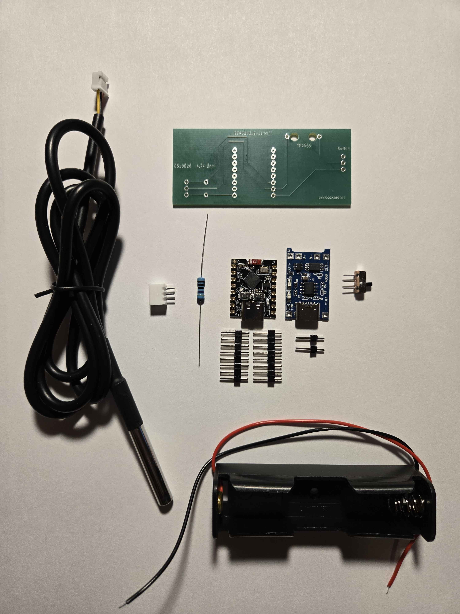

Carrier PCB · **ESP32-C3 SuperMini** · waterproof **DS18B20 probe** (JST-PH
pre-terminated) · **4.7 kΩ** pull-up resistor · **TP4056** charge/protect board ·
slide switch · **18650 holder** · header pins · JST connector · **USB-C data cable**
(not pictured above).

**You add:**
- **One 18650 cell** — a reputable **flat-top or protected** 18650, ~2500–3500 mAh
  (the TP4056 provides protection either way). *Avoid "ultra-high-mAh" counterfeits.*
  Not included: shipping rules on loose lithium.
- A **soldering iron**, solder, and **flux** (a flux pen makes wetting far easier).
- A **multimeter** for the continuity checks in Step 5.

## Pinout (for reference)

| Signal | ESP32-C3 pin | Notes |
|--------|--------------|-------|
| DS18B20 data (DQ) | **GPIO5** | the carrier routes the probe's DATA line here |
| DS18B20 pull-up | **GPIO5 ↔ 3V3** | the 4.7 kΩ resistor — **required**, the bus won't read without it |
| Status LED | **GPIO8** | the SuperMini's on-board LED (active-low); no external LED needed |
| Power | **5V / GND / 3V3** | from the TP4056 output through the switch |

The **blue** LED flashes on each successful upload; the **red** LED is power/charge.

---

## Step 1 — Solder the ESP32-C3 SuperMini

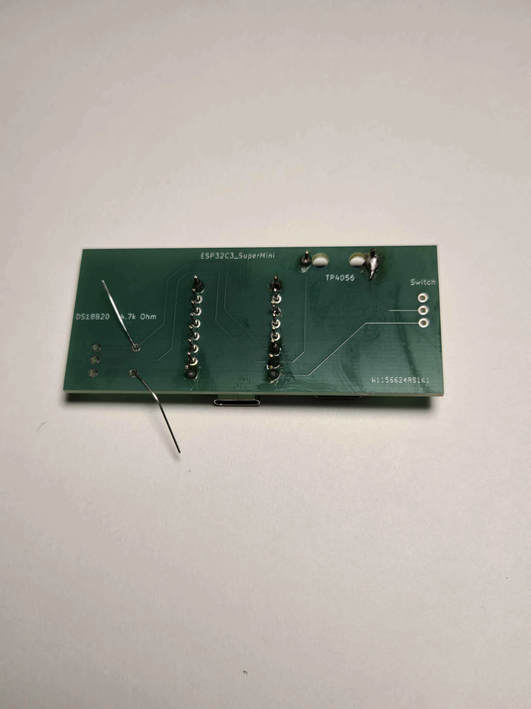

Dry-fit the module in the two header rows with its **USB-C facing the board edge**,
then solder from the back. The pads tie into large copper pours that wick heat, so:

- Run the iron a little hotter and hold it on the pad + pin together for ~2 s, then
  feed solder **into the joint** (not onto the tip). A **dab of flux** makes it flow.
- You need the four functional pins — **GPIO5, 5V, G, and 3V3** — plus, for a solid
  mechanical mount, **the two end/corner pins** (every buyer plugs the USB-C to
  flash, and insertion force on too few joints can fatigue them).
- A good joint is a **shiny cone**. Reflow any dull, balled-up ones.

## Step 2 — Solder the switch, 4.7 kΩ resistor, and DS18B20 connector

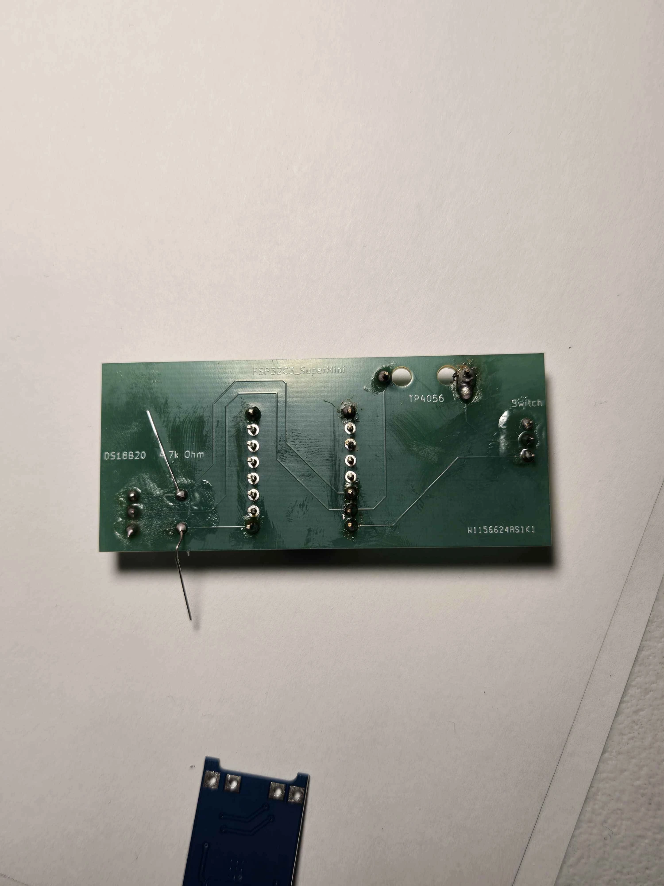

Finish **all the flat, trace-side soldering** before you add the TP4056 module:

- **4.7 kΩ resistor** into the `4.7k Ohm` position (it's the DS18B20 pull-up).
- **Slide switch** into the `Switch` pads.
- **DS18B20 JST connector** into the `DS18B20` pads, **notch facing the board edge**
  so that when the probe plugs in, DATA / GND / VCC land on the correct pins.

> Getting that notch backwards is the classic silent failure (reads **−127**). If in
> doubt, meter the probe's DATA wire to **GPIO5** before trusting it.

## Step 3 — Solder the TP4056

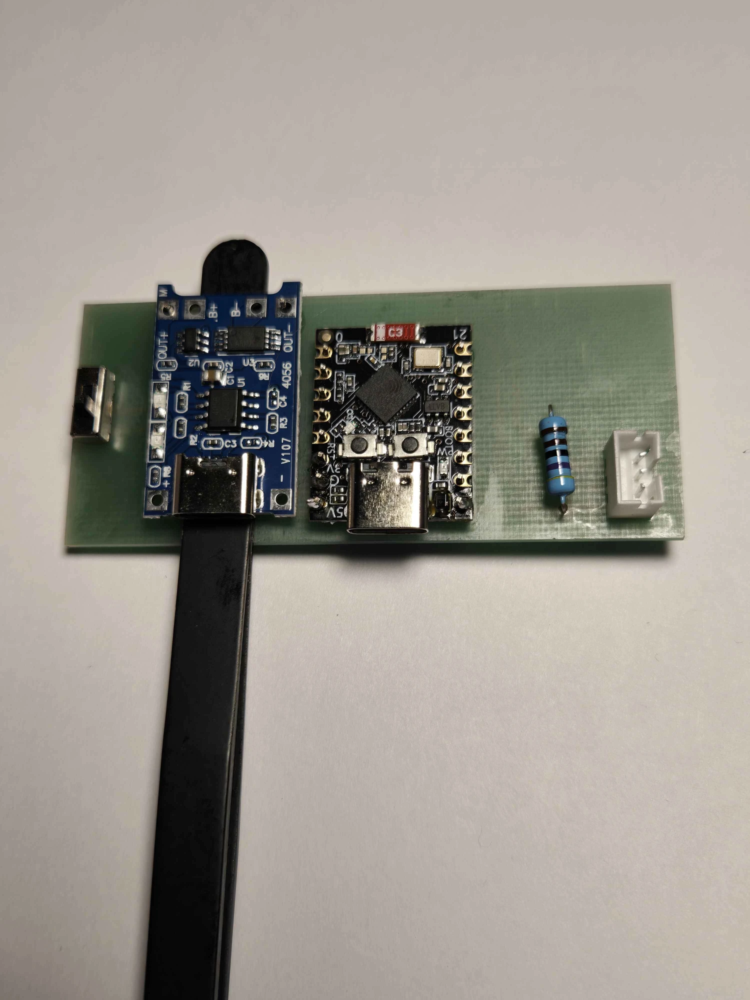

With the trace side done, mount the TP4056 on its two pads. **Tip:** rest a pair of
tweezers under the far edge so the board sits **level with the ESP module** while you
tack the first pin, then solder the rest. Keep its USB port facing the same edge as
the ESP's.

## Step 4 — Wire the 18650 holder

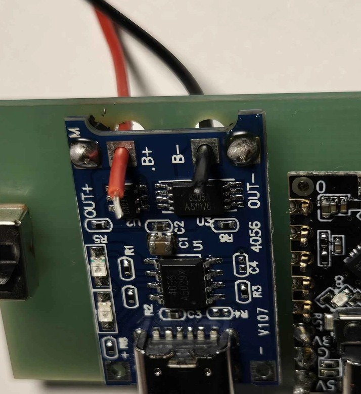

Pass the holder's leads **through the back of the board** first (built-in strain
relief), then solder **red → B+** and **black → B−** on the TP4056. Double-check
polarity with the meter before the cell ever goes in.

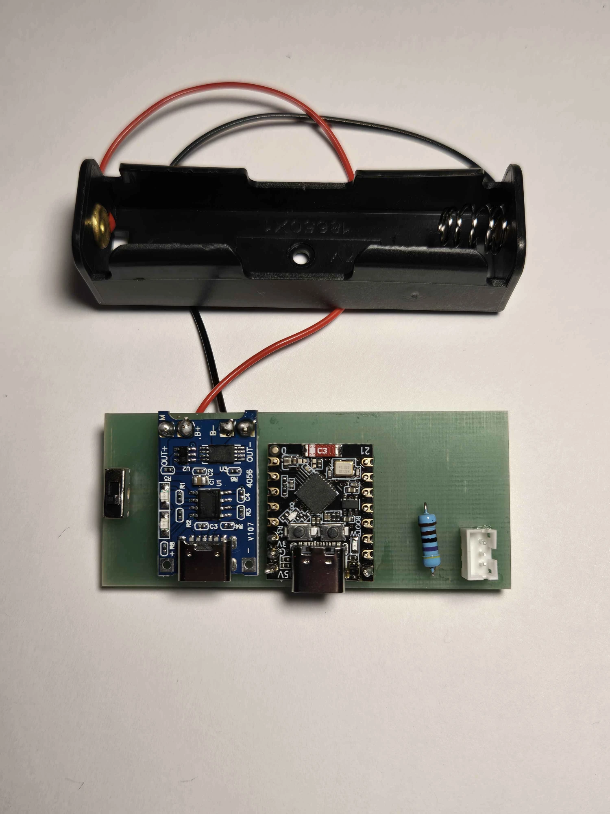

That's all the soldering finished. Before you add the cell, run the quick meter
checks below.

## Step 5 — Verify before you power it (meter checks)

Do these with the cell **not yet installed** — this is your last easy-to-reach
checkpoint:

1. **DS18B20 DATA → GPIO5** — continuity (proves the probe will read).
2. **4.7 kΩ across GPIO5 ↔ 3V3** — reads ~4.7 kΩ (pull-up in place).
3. **No bridges** — meter adjacent header pins, and the TP4056's `B+ / B− / OUT+ /
   OUT−` against each other. All **open** except where the board ties them. *A short
   on the TP4056 pads is a battery short — check this before inserting the cell.*

## Step 6 — Flash the firmware (browser)

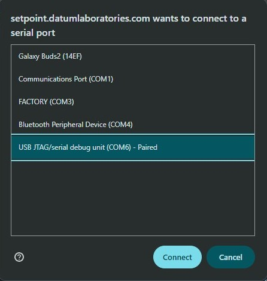

Open **setpoint.datumlaboratories.com/flash/** in **Chrome or Edge**, plug the
**SuperMini's USB-C** into your computer **with the power switch OFF** (USB powers the
board; an off switch keeps it from back-feeding the cell). Click **Flash**, and pick
**"USB JTAG/serial debug unit."**

> **Board keeps connecting/disconnecting, or no port shows?** Force download mode:
> **hold BOOT, tap RST, release BOOT**, then pick the port. Common on a blank C3.

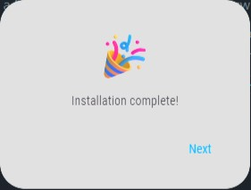

## Step 7 — Add the battery and power on

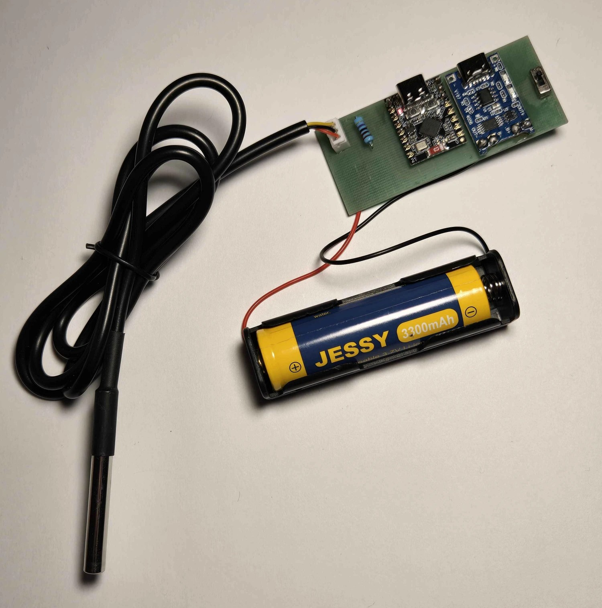

Insert your **18650** (mind polarity), then slide the switch **ON**. The board's
**red LED** lights — it's alive.

## Step 8 — Join it to your Wi-Fi (from your phone)

On first boot the probe opens an open setup network named after its serial,
**`Setpoint-XXXXXX`**. Join it; your phone will warn *"no internet"* — choose
**Connect**. The setup page should pop up on its own; if it doesn't, open a browser
and go to **`http://192.168.4.1`**.

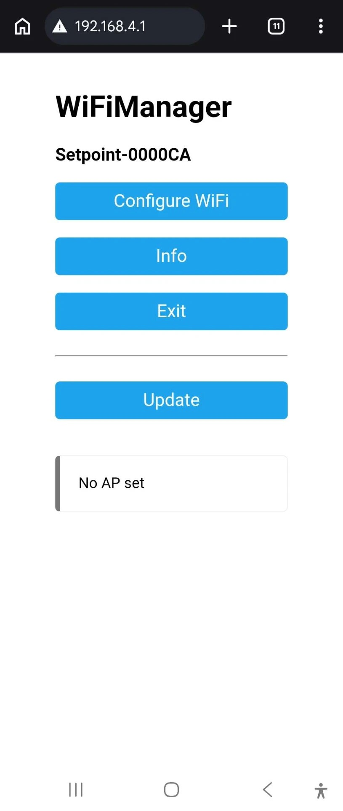

Tap **Configure WiFi**, pick your **2.4 GHz** network (the probe is 2.4 GHz only),
enter the password, and **Save**. Credentials persist — it reconnects on its own
after this.

## Step 9 — Confirm it's reporting

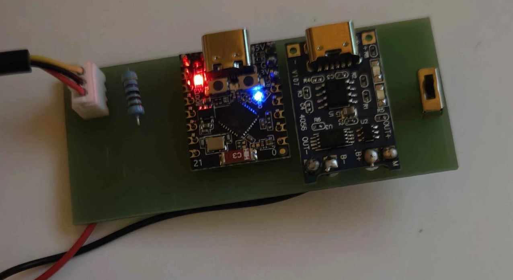

With the hub app running, the **blue LED flashes** on each successful upload. Within
a minute the probe appears on your dashboard with live temperature:

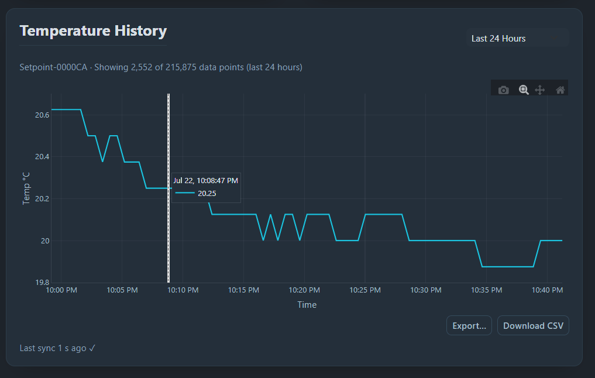

Pinch the probe tip — the reading should rise. Set a high/low alert and you're done.

---

## Troubleshooting

| Symptom | Fix |
|---|---|
| Reads **−127** or blank | 4.7 kΩ pull-up not seated, or the JST connector is reversed (notch to the board edge). Meter DATA → GPIO5. |
| Flasher can't see the port | Chrome/Edge over HTTPS, and a **data** cable (not charge-only). |
| Port drops / board keeps re-connecting | Force download mode: **hold BOOT, tap RST, release BOOT**, then flash. |
| No LED on USB | Solder bridge, charge-only cable, or wrong USB-C port (use the **SuperMini's**). |
| No LED on battery (USB works) | Switch is OFF, or the cell is flat/reversed — recheck B+/B− polarity. |
| Won't join Wi-Fi | Must be **2.4 GHz**; re-enter the password. |
| Nothing on the dashboard | The hub PC and the probe must be on the same network. |

Only the **stainless probe tip** is immersible — keep the board and cell dry.

---

## For the maker — kit packing & shipping

*Seller-facing fulfillment SOP. Buyers can skip this — it's here so every batch
packs identically without re-deriving it.* Per-unit materials ≈ **$8.98**
(Jul 2026 batch of 50; line items in [BOM.md](BOM.md)).

### Pack each kit

1. **Antistatic bag (8×12 cm)** → the two active boards: **ESP32-C3 SuperMini +
   TP4056**. Only the semiconductors need ESD protection.
2. **Small poly bag (~2×3 in)** → the losable passives: **4.7 kΩ resistor +
   slide switch + header pins + spare JST**. One bag stops them scattering in the
   box — the #1 "a part is missing" ticket. (The resistor is passive; it does
   *not* need an antistatic bag.)
3. **DS18B20 probe** — coil the 1 m lead and secure with a twist tie so it can't
   tangle around the other parts.
4. **Carrier PCB + 18650 holder** — loose is fine (big, robust).
5. **USB-C cable** — coiled.
6. Nest it all in the **PE foam pouch**, lay a **1/16" foam sheet** on top to fill
   the void (stops rattle, protects the probe tip and header pins), and set the
   **quick-start card on top of the foam** so it's the first thing the buyer sees.
7. Close the **7×5×2 in box**.

**No cell in the box.** The kit is cell-not-included (loose-lithium shipping
rules). If a listing ever bundles an 18650, that cell ships **separately with its
terminals taped** — never loose against the boards or header pins (dead-short and
fire risk).

### Weight & postage

- **Final packed weight ≈ 5 oz (~0.35 lb)** — box + foam + parts + cable + card,
  no cell. Put **0.4 lb** in Tindie's weight field (informational under a flat
  rate; the headroom is free). Re-weigh a finished kit to confirm it's under 8 oz.
- **Carrier: USPS Ground Advantage** — flat **$6 first item / $2 each
  additional**, domestic-only, tracking on. **Buy the label online** (Tindie's
  label tool or Pirate Ship) for *commercial* pricing (~$4.50–6 at this
  weight/zone, vs. ~$1–1.50 more at the counter).
- The **7×5×2 in box carries no size penalty** — Ground Advantage prices by weight
  only until a package tops 1 ft³ (this box is ~4% of that).

### Pack checklist — count before sealing

Carrier PCB · ESP32-C3 SuperMini · TP4056 · DS18B20 probe · 4.7 kΩ resistor ·
slide switch · header pins · JST connector · 18650 holder · USB-C cable ·
quick-start card.

<!--
IMAGE MANIFEST: the photos above are not committed yet. Save each build photo to
docs/images/assembly/ under the filename referenced in the  tags. The
mapping (which of your shots → which filename, plus crop notes) is in
docs/images/assembly/README.md.
-->
