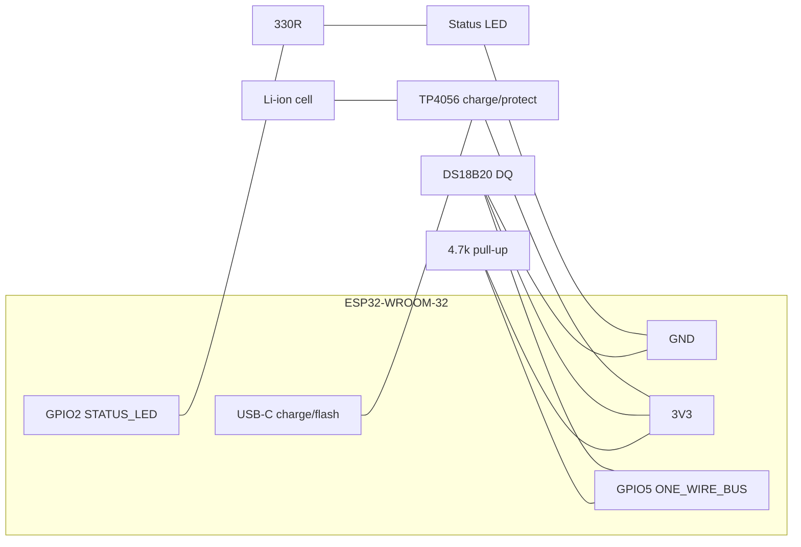

# Setpoint — Assembly Guide

How to build one Setpoint unit — the rechargeable, battery-powered wireless
sensor. Parts are in [BOM.md](BOM.md). Every pin number here is copied from
`firmware/src/protocol.h` — **if you change a pin in the firmware, change it here
too**, or the hardware and the flashed firmware will drift apart. The shipping
firmware is the sketch `esp32_temp_probe/esp32_temp_probe.ino`.

- Firmware: **v2.7.0**, protocol v1
- MCU: ESP32-WROOM-32 / -32E
- Sensor (only one supported): DS18B20 on **GPIO5**, 4.7 kΩ pull-up to **3V3**
- Status LED: **GPIO2** (`LED_BUILTIN`, active-high; on-board LED on most dev boards)
- Power: rechargeable lithium cell via a TP4056 charge/protect board (USB-C for
  charging + flashing); the firmware deep-sleeps between readings for battery life
- **Future / not in current firmware:** MAX31855 thermocouple (SPI) and SHT4x
  temp+humidity (I2C) — documented for future variants only, **not** built by
  v2.7.0. Do not populate them on shipping units.

---

## 1. GPIO pinout (matches `protocol.h`)

| Signal | ESP32 GPIO | `protocol.h` macro | Connects to |
|--------|-----------|--------------------|-------------|
| DS18B20 data (DQ) | **GPIO5** | `ONE_WIRE_BUS` | DS18B20 yellow/white DATA lead |
| DS18B20 pull-up | GPIO5 ↔ 3V3 | (4.7 kΩ) | 4.7 kΩ between GPIO5 and 3V3 |
| Status LED | **GPIO2** | `STATUS_LED` (`STATUS_LED_ACTIVE_HIGH=1`) | LED anode (via 330 Ω) |
| Power | 3V3, GND | — | sensor VDD/GND, LED cathode, battery board 3V3 out |

The optional MAX31855 (SPI: SCK GPIO18, MISO/SO GPIO19, CS to a free GPIO) and
SHT4x (I2C: SDA GPIO21, SCL GPIO22) pins are **future/experimental only** and are
not part of the shipping DS18B20 build.

Runtime power comes from the **lithium cell + TP4056** board's 3V3 output; the
**USB-C** connector is used to charge the cell and to flash the ESP32.

---

## 2. Wiring diagram

### Standard DS18B20 build

```
                         ESP32-WROOM-32 devkit
                       +-----------------------+
                       |                       |
      DS18B20          |                       |
   (waterproof)        |                  3V3 o---+------------+
   +----------+        |                       |  |            |
   | RED  VDD |--------o 3V3                    |  |          [4.7k]   <- pull-up
   | BLK  GND |--------o GND                    |  |            |
   | YEL  DQ  |--------o GPIO5  (ONE_WIRE_BUS) o-+--+------------+
   +----------+        |                       |
                       |                  GPIO2 o----[330R]----|>|----o GND
                       |             (STATUS_LED)          status LED
                       |                       |
                       |                 USB-C o====  charge / flashing
                       +-----------------------+

   Pull-up: 4.7k resistor from GPIO5 (DQ) to 3V3  -- REQUIRED, bus won't read without it.
   LED: GPIO2 -> 330R -> LED anode -> LED cathode -> GND (active-high).
```

### Battery + charging (TP4056)

```
     USB-C  ===>  TP4056 (charge + protection)  ===>  ESP32 dev board
                      |  BAT+ / BAT-                    3V3 rail powers
                      v                                 DS18B20 + LED
                 [ Li-ion cell ]

   - USB-C into the TP4056 charges the cell and (on boards with pass-through)
     runs the ESP32 while plugged in.
   - TP4056 OUT+ / OUT- feed the ESP32's 3V3/5V input per your board's spec.
   - Use a PROTECTED cell or a TP4056 variant WITH protection (over-discharge
     cut-off) so deep-sleep runtime never drains the cell below safe voltage.
```

### Future/experimental sensor variants (NOT built by current firmware)

These are reference wirings for possible future firmware only. The v2.7.0
firmware has no code path for them — do not wire them on shipping units.

```
   MAX31855 (SPI):  SCK->GPIO18, SO(MISO)->GPIO19, CS->(a free GPIO), 3V3, GND
                    (GPIO5, the old CS pin, is now the DS18B20 data pin)
   SHT4x    (I2C):  SDA->GPIO21, SCL->GPIO22, 3V3, GND   (no pull-up; free air)
```



---

## 3. Step-by-step assembly

1. **Bench-test the bare board first.** Plug the ESP32 into USB-C and flash the
   Setpoint firmware (**v2.7.0**, via `arduino-cli`/Arduino IDE — see
   `firmware/README.md`). Confirm it boots and prints its `probe_id`
   (`Setpoint-<HEX6>`) and the `[label]` line over serial before you solder
   anything.
2. **Fit the 4.7 kΩ pull-up.** Solder the 4.7 kΩ resistor between **GPIO5** and
   **3V3**. This is mandatory for the DS18B20 OneWire bus. Easiest is to solder it
   directly across the two header pins or on a small perfboard tab.
3. **Wire the DS18B20.**
   - RED (VDD) → **3V3**
   - BLACK (GND) → **GND**
   - YELLOW/WHITE (DQ) → **GPIO5** (same node as the pull-up)
   Twist/heatshrink the joints; the pull-up must sit on the GPIO5/DQ node.
4. **Wire the status LED** (skip if you're using the board's on-board GPIO2 LED):
   **GPIO2** → 330 Ω → LED **anode**; LED **cathode** → **GND**. Active-high, so it
   lights when GPIO2 is driven high.
5. **Fit the battery + charge board.** Mount the TP4056 (charge + protection) so
   its USB-C aligns with the enclosure cutout. Wire the cell to BAT+/BAT−, and the
   board's OUT+/OUT− to the ESP32 per your board's power input. Use a **protected**
   cell (or a protected TP4056 variant) so deep sleep can't over-discharge it.
6. **Route the probe lead through the enclosure gland/grommet** *before* final
   soldering so you don't have to re-thread it. Leave a service loop inside.
7. **Add strain relief:** tighten the cable gland, or anchor the lead to an
   internal boss with a zip-tie so cable pulls never reach the solder joints.
8. **Mount the board + cell**, dress the wires clear of the lid, and close the
   enclosure. Keep the ESP32, resistor, and battery **dry** — only the stainless
   probe tip is immersible.

---

## 4. Enclosure notes

- ~65×50×25 mm ABS box (BOM enclosure item) fits a 38-pin devkit plus the cell
  and TP4056 with room for the gland.
- Put the **USB-C port on one short wall** (cutout, aligned to the TP4056) and the
  **probe gland on the opposite wall** so the charge cable and sensor cable exit
  apart.
- For fridge/freezer/greenhouse, run a bead of **neutral-cure (non-acetic)**
  silicone around the gland and USB cutout to block condensation ingress.
- Don't seal the box fully airtight if it lives through freeze/thaw cycles — a
  tiny vent or the gland's cable path lets pressure equalize and reduces internal
  condensation.
- Only the stainless DS18B20 tip should contact product; keep the epoxy strain
  joint and lead out of food (see BOM waterproofing/food-safe notes).

---

## 5. First power-on check

1. **Power up** (battery fitted, or on USB-C). The **GPIO2 status LED** should
   light/blink per the firmware boot pattern.
2. **Setup Wi-Fi:** a fresh unit with no saved credentials brings up an **open**
   SoftAP (no password) whose SSID **is the probe id**, `Setpoint-<HEX6>`. Join
   it and open **http://192.168.4.1** (WiFiManager captive portal) to pick your
   home Wi-Fi. Credentials persist to NVS; on later deep-sleep wakes the probe
   fast-reconnects without re-opening the portal.
3. **Verify identity/sensor:** on the same network, GET
   `http://Setpoint-<HEX6>.local/whoami` →
   `{id,name,mac,ds18b20_rom,fw_version,...}` (`fw_version` == `2.7.0`) and
   `http://Setpoint-<HEX6>.local/status` → `{...,last_c,...}`.
   - A plausible room temperature in `last_c` (roughly 15–30 °C) = DS18B20 wired
     correctly.
   - `85.0` (power-on default), `-127`, or `NaN` = the sensor isn't being read →
     **check the 4.7 kΩ pull-up on GPIO5** and the DQ/VDD/GND joints first.
4. **Provision from the hub:** Setpoint auto-discovers the probe over mDNS
   (`_temps-probe._tcp.local.`) and pushes the ingest URL + token via
   `POST /provision`. Within one interval you should see rows land in the hub's
   telemetry CSV
   (`timestamp,temperature_c,temperature_f,probe_id,humidity_pct,vpd_kpa`) and the
   probe appear at **http://localhost:8080** on the Setpoint dashboard.
5. **Confirm posting:** a fresh row for this `probe_id` in the hub CSV / on the
   dashboard means ingest works. If no rows arrive, it is a hub/token/URL issue,
   not a wiring fault (the probe buffers readings to LittleFS meanwhile and flushes
   them when the hub is reachable).

If temperature reads plausibly and rows land on the hub, the unit is good to
close up and label.
